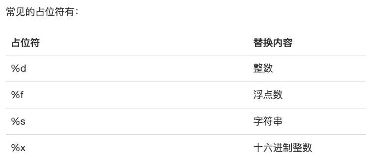

## Python Recode

### str编码
python的字符串类型是str，在内存中以Unicode表示，一个字符对应若干个字节，如果要在网络上传输或者保存到磁盘上，需要把str变成以字节为单位的bytes  
用带b前缀表示bytes类型，bytes的每个字符都只占用一个字节  
x = b'ABC'  # 'ABC'和b'ABC'表现相同，编码不同  
python对1⃣️Unicode表示的str使用 encode() 方法编码为指定的bytes  
从网络或磁盘读取的字节流bytes数据使用 decode() 方法转换成str

在操作字符串时，我们经常遇到str和bytes的互相转换。为了避免乱码问题，应当始终坚持使用UTF-8编码对str和bytes进行转换。  
由于Python源代码也是一个文本文件，所以，当你的源代码中包含中文的时候，在保存源代码时，就需要务必指定保存为UTF-8编码。当Python解释器读取源代码时，为了让它按UTF-8编码读取，我们通常在文件开头写上这两行：  

    #!/usr/bin/env python3
    # -*- coding: utf-8 -*-

第一行注释是为了告诉Linux/OS X系统，这是一个Python可执行程序，Windows系统会忽略这个注释；  
第二行注释是为了告诉Python解释器，按照UTF-8编码读取源代码，否则，你在源代码中写的中文输出可能会有乱码。  
申明了UTF-8编码并不意味着你的.py文件就是UTF-8编码的，必须并且要确保文本编辑器正在使用UTF-8 without BOM编码  

### 格式化输出字符串
在python中使用 % 进行格式化

    >>> 'Hello, %s' % 'world'
    'Hello, world'
    >>> 'Hi, %s, you have $%d.' % ('Michael', 1000000)
    'Hi, Michael, you have $1000000.'

